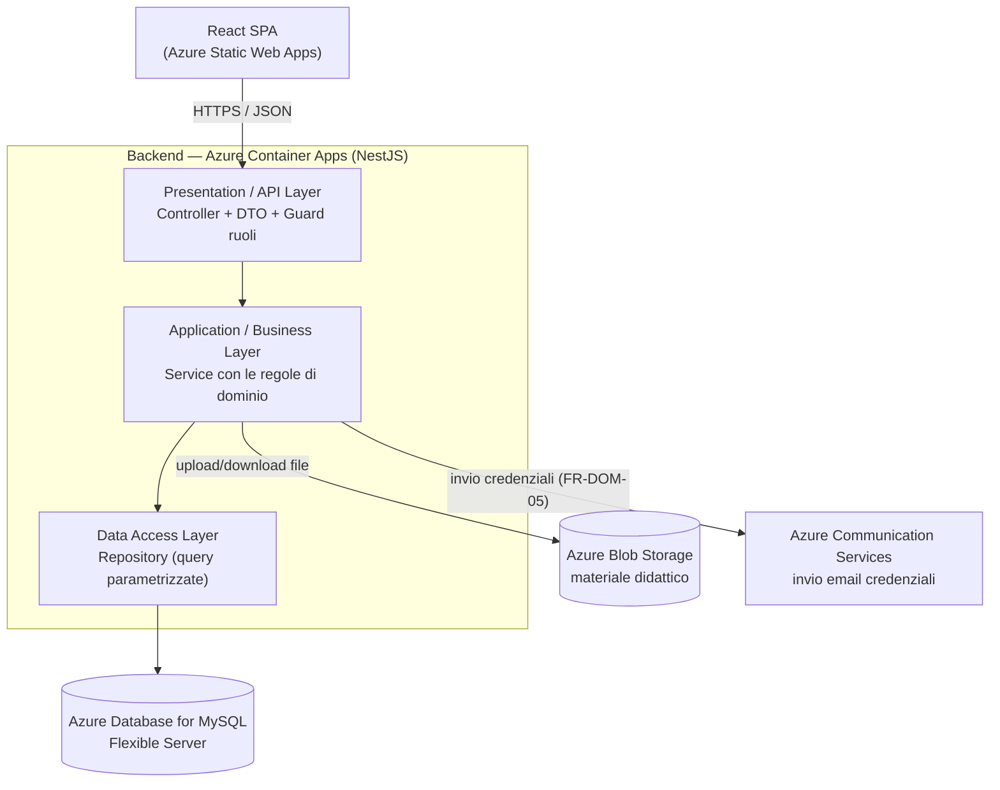
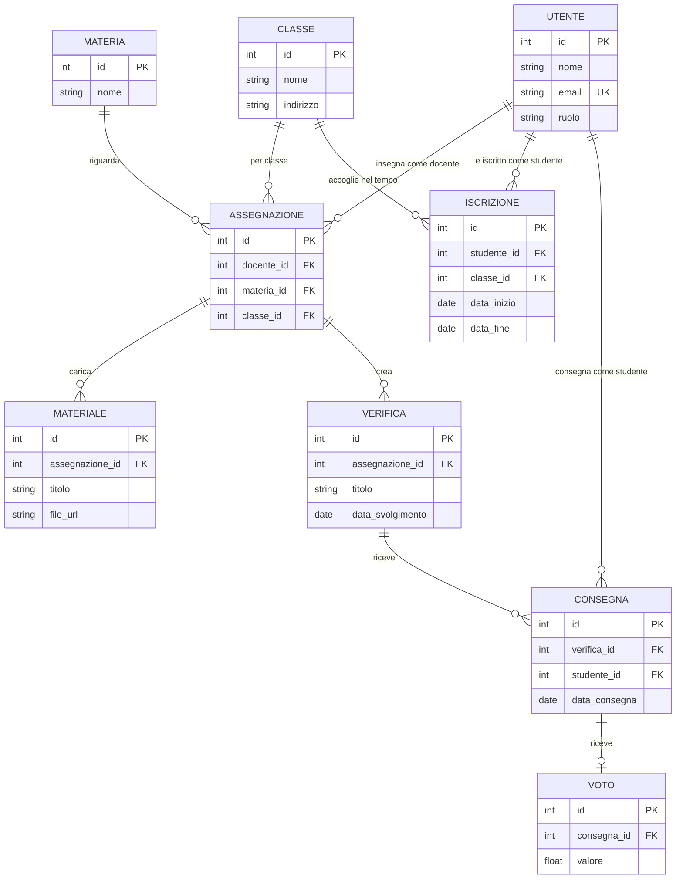

# PDR ScuolaChill - Barbazza

## Informazioni sul documento

|              |                  |
| ------------ | ---------------- |
| **Prodotto** | ScuolaChill      |
| **Team**     | Barba industries |
| **Autori**   | Matteo Barbazza  |
| **Versione** | 1.0              |
| **Data**     | 23/09/2026       |
| **Stato**    | Bozza            |

#### Storico delle versioni

| Versione | Data       | Autore          | Cosa è cambiato e perché |
| -------- | ---------- | --------------- | ------------------------ |
| 1.0      | 23/09/2026 | Matteo Barbazza | Prima stesura            |

# Prima parte - Il cosa

## Scopo e perimetro

#### Perché esiste ScuolaChill

**Dal lato business.**: facilita i tre utenti (Direttore, Docente, Studente) allo svolgimento della vita scolastica/lavorativa con gestione e organizzazione delle varie attività e scolastiche

**Dal lato tecnico**: Velocizza e rende efficente l'organizzazione di varie funzionalità

#### Cosa è incluso

- Gestione di classi, docenti e studenti da parte del Direttore

- Caricamento di materiale scolastico, verifiche e voti da parte del Docente

#### Cosa non è incluso

- Avvisi comunicativi da parte della scuola alle famiglie

- Un sistema di appello per le presenze

# Stakeholder

| Stakeholder                 | Cosa fa                                                     | Cosa gli interessa                                        | Come lo coinvolgete                                                                     |
| --------------------------- | ----------------------------------------------------------- | --------------------------------------------------------- | --------------------------------------------------------------------------------------- |
| Direttore                   | Fornisce gli accessi e i dati necessari allo sviluppo       | Gestisce/crea profili e classi, è il ruolo più importante | Riunioni costanti per ridefinire il progetto e ottenere info e feedback dai suoi test   |
| Docente                     | Usa il sistema quotidianamente per le proprie materie       | Carica il materiale, crea le verifiche e assegna i voti   | Riunioni periodiche per ridefinire il progetto e ottenere info e feedback dai suoi test |
| Studente                    | Usa il sistema per studiare e consultare i propri risultati | Vede materiale, svolge verifiche, controlla i voti        | Collaudo diretto come utente reale del primo anno                                       |
| Docente del corso           | Valida il PRD                                               | Che le scelte siano motivate e coerenti                   | Presentazione e domande di validazione                                                  |
| Collaudatori del primo anno | Usano ScuolaChill come utenti reali                         | Un'app semplice da usare senza aiuto                      | Intervista e collaudo guidato                                                           |

## Destinatari e contesto d'uso

#### La scuola che avete immgaginato

il software è progettato per l'istituto superiore don bosco san donà di piave "SFB don bosco (istituto tecnico)".

|                    | Valore                                                                                                     |
| ------------------ | ---------------------------------------------------------------------------------------------------------- |
| Numero di studenti | 400                                                                                                        |
| Numero di docenti  | 46                                                                                                         |
| Numero di classi   | 18-20                                                                                                      |
| Orario scolastico  | Lun/Mer/Ven 8:00-13:30, Mar/Gio 8:00-16:30                                                                 |
| Connettività       | Wi-Fi scolastico condiviso per gli studenti in aula; connessione personale (dati mobili/casa) fuori orario |

### Gli archetipi

| ID      | Archetipo | Contesto d'uso                                                                  | Competenze digitali                                    | Dispositivo principale                                          | Frequenza d'uso |
| ------- | --------- | ------------------------------------------------------------------------------- | ------------------------------------------------------ | --------------------------------------------------------------- | --------------- |
| ARC-001 | Direttore | Usa il registro per controllare l'attività giornaliera, gestire classi e utenti | Medie (uso quotidiano di strumenti gestionali)         | Computer, a volte cellulare                                     | Frequente       |
| ARC-002 | Docente   | Carica materiale, crea verifiche, assegna voti per le proprie materie e classi  | Variabili da materia a materia                         | Computer o cellulare                                            | Frequente       |
| ARC-003 | Studente  | Consulta materiale, svolge verifiche, controlla i propri voti                   | Alte (nativi digitali, ma collaudatori del primo anno) | Smartphone come dispositivo principale, computer in laboratorio | Frequente       |

## Panoramica e casi d'uso

ScuolaChill è un registro elettronico che permette a Direttore, Docenti e Studenti di gestire comodamente la vita scolastica: creazione di classi e utenti, materiale didattico, verifiche e voti. Tramite il login, ogni utente accede solo alle operazioni e ai dati previsti dal proprio ruolo.

### User flow e scenari

**Storia: DIR-01 · Creare account docente**

User flow:

1. Il Direttore effettua il login
2. Apre la sezione "Crea utente"
3. Inserisce i dati del docente (nome, cognome, email)
4. Conferma la creazione

Scenario principale: il Direttore crea l'account di un nuovo docente assunto a inizio anno; l'account viene creato con ruolo Docente e compare subito nell'elenco.

Scenari alternativi: se l'email inserita è già registrata, il sistema mostra l'errore e non crea nulla; il Direttore corregge l'email e riprova.

**Storia: STU-02 · Svolgere una verifica**

User flow:

1. Lo studente effettua il login
2. Apre la sezione "Verifiche" della materia
3. Seleziona la verifica disponibile per la propria classe
4. Compila le risposte e consegna

Scenario principale: uno studente apre la verifica di Sistemi e Reti alle 9:00 insieme al resto della classe, risponde e consegna entro l'orario previsto.

Scenari alternativi: se lo studente ha già consegnato, il sistema nega un secondo tentativo; se la connessione cade durante lo svolgimento, al rientro lo studente ritrova le risposte già date (vedi decisione FR-DOM-04).

**Storia: DOC-03 · Assegnare i voti**

User flow:

1. Il Docente effettua il login
2. Apre la verifica svolta dalla classe
3. Seleziona uno studente che ha consegnato
4. Inserisce il voto e conferma

Scenario principale: il Docente corregge le consegne della sua verifica e assegna un voto a ciascuno studente; ogni voto diventa visibile allo studente corrispondente.

Scenari alternativi: se il Docente inserisce un voto fuori scala, il sistema rifiuta e chiede un valore valido; se il Docente prova ad assegnare un voto su una verifica non sua, l'operazione viene negata.

## Le User stories

Gli ID seguono esattamente quelli della traccia, così restano stabili in commit, test e validazione. Gli AC minimi sono quelli della traccia; quelli aggiuntivi sono marcati "(aggiunto dal team)".

**Direttore**

_DIR-01 — Creare account docente_: come Direttore voglio creare gli account dei docenti così da dare al personale l'accesso al sistema con il ruolo corretto.

    AC-01: Dato che sono autenticato come Direttore, Quando creo un docente con dati validi, Allora l'account viene creato con ruolo Docente e compare nell'elenco dei docenti.

    AC-02: Dato che esiste già un utente con la stessa email, Quando provo a crearne un altro, Allora ricevo un errore chiaro e nessun account viene creato.

    AC-03: Dato che sono autenticato come Docente o Studente, Quando provo a creare un docente, Allora l'operazione viene negata.

_DIR-02 — Creare account studente_: come Direttore voglio creare gli account degli studenti così da permettere a ogni iscritto di usare l'applicazione.

    AC-01: Dato che sono autenticato come Direttore, Quando creo uno studente con dati validi, Allora l'account viene creato con ruolo Studente.

    AC-02: Dato che invio dati incompleti o non validi, Quando confermo la creazione, Allora ricevo l'indicazione puntuale dei campi errati e nessun account viene creato.

    AC-03: Dato che sono autenticato come Docente o Studente, Quando provo a creare uno studente, Allora l'operazione viene negata.

_DIR-03 — Creare classi e comporle_: come Direttore voglio creare le classi e assegnarvi studenti e docenti con le rispettive materie così da riprodurre l'organizzazione reale della scuola.

    AC-01: Dato che sono autenticato come Direttore, Quando creo una classe e vi assegno studenti, Allora ogni studente risulta appartenere a quella classe.

    AC-02: Dato che una classe esiste, Quando vi assegno un docente per una materia, Allora il docente vede quella classe fra le proprie e può operarvi solo per quella materia.

    AC-03: Dato che uno studente è già assegnato a una classe, Quando provo ad assegnarlo a una seconda classe, Allora il sistema mi chiede conferma e, se confermo, gestisce il trasferimento in modo esplicito (vedi decisione FR-DOM-02).

_DIR-04 — Vedere tutto_: come Direttore voglio una vista complessiva su classi, docenti, studenti e voti così da monitorare l'andamento della scuola senza entrare in ogni singola pagina.

    AC-01: Dato che sono autenticato come Direttore, Quando apro la vista complessiva, Allora vedo i dati aggregati della scuola (classi con numero di studenti, docenti con materie, andamento dei voti).

    AC-02: Dato che gli elenchi superano la dimensione di una pagina, Quando li consulto, Allora i risultati sono paginati.

    AC-03: Dato che sono autenticato come Docente o Studente, Quando provo ad accedere alla vista complessiva, Allora l'operazione viene negata.

**Docente**

_DOC-01 — Caricare materiale didattico_: come Docente voglio caricare il materiale didattico per le mie materie e classi così da metterlo a disposizione degli studenti in un posto solo.

    AC-01: Dato che sono autenticato come Docente e assegnato a una classe per una materia, Quando carico un materiale per quella classe e materia, Allora gli studenti della classe lo vedono nell'elenco della materia.

    AC-02: Dato che non sono assegnato a una classe, Quando provo a caricarvi materiale, Allora l'operazione viene negata.

    AC-03: Dato che ho caricato un materiale, Quando lo modifico o lo elimino, Allora l'operazione riesce solo se il materiale è mio.

_DOC-02 — Creare le proprie verifiche_: come Docente voglio creare verifiche per le mie classi così da valutare gli studenti sulle mie materie.

    AC-01: Dato che sono autenticato come Docente e assegnato a una classe per una materia, Quando creo una verifica con titolo, materia, data e contenuto, Allora la verifica risulta visibile agli studenti di quella classe.

    AC-02: Dato che una verifica è mia, Quando la modifico prima della data di svolgimento, Allora le modifiche sono salvate; dopo la data di svolgimento la modifica viene negata (vedi decisione FR-DOM-03).

    AC-03: Dato che una verifica appartiene a un altro docente, Quando provo a modificarla, Allora l'operazione viene negata.

    AC-04: Dato che carico una verifica con lo stesso titolo di una già esistente per la stessa classe e materia, Quando confermo, Allora ricevo un avviso di conferma prima di procedere (non un blocco, perché due verifiche omonime in periodi diversi sono un caso legittimo).

_DOC-03 — Assegnare i voti_: come Docente voglio assegnare i voti delle mie verifiche così da registrare formalmente la valutazione di ogni studente.

    AC-01: Dato che uno studente ha svolto una mia verifica, Quando gli assegno un voto valido, Allora il voto è registrato e lo studente può vederlo fra i propri.

    AC-02: Dato che inserisco un voto fuori dalla scala prevista (0-10, step 0.5 — vedi decisione FR-DOM-01), Quando confermo, Allora ricevo un errore e il voto non viene registrato.

    AC-03: Dato che la verifica appartiene a un altro docente, Quando provo ad assegnare un voto, Allora l'operazione viene negata.

**Studente**

_STU-01 — Consultare il materiale didattico_: come Studente voglio consultare il materiale caricato da ogni docente delle mie materie così da avere tutto ciò che serve per studiare in un unico posto.

    AC-01: Dato che sono autenticato come Studente, Quando apro una materia della mia classe, Allora vedo il materiale caricato dal docente di quella materia.

    AC-02: Dato che un materiale appartiene a una classe diversa dalla mia, Quando provo ad accedervi, Allora l'operazione viene negata.

_STU-02 — Svolgere una verifica_: come Studente voglio svolgere le verifiche assegnate alla mia classe così da essere valutato sulle materie che seguo.

    AC-01: Dato che una verifica è disponibile per la mia classe, Quando la svolgo e consegno, Allora le mie risposte sono salvate e la verifica risulta consegnata.

    AC-02: Dato che ho già consegnato una verifica, Quando provo a svolgerla di nuovo, Allora l'operazione viene negata.

    AC-03: Dato che la verifica appartiene a un'altra classe, Quando provo ad accedervi, Allora l'operazione viene negata.

    AC-04: Dato che sono autenticato come Studente, Quando apro la sezione verifiche, Allora le vedo organizzate per data di scadenza, anche quelle non ancora disponibili per lo svolgimento.

    AC-05 (aggiunto dal team): Dato che la connessione cade durante lo svolgimento, Quando mi riconnetto prima della consegna, Allora ritrovo le risposte già date fino a quel momento (vedi decisione FR-DOM-04).

_STU-03 — Consultare i propri voti_: come Studente voglio consultare i miei voti raggruppati per materia così da sapere come sto andando in ciascuna.

    AC-01: Dato che ho voti registrati, Quando apro la pagina dei voti, Allora li vedo raggruppati per materia con l'indicazione della verifica di provenienza e la media per materia.

    AC-02: Dato che sono autenticato come Studente, Quando provo a consultare i voti di un altro studente, Allora l'operazione viene negata.

> **Nota di riconciliazione**: nella bozza precedente "Stu-02" era "vedere i compiti assegnati" — concetto diverso da STU-02 della traccia, che è "svolgere una verifica". L'idea di consultare le verifiche in arrivo non è persa: è diventata l'AC-04 di STU-02 sopra, mentre lo svolgimento vero e proprio (con blocco su doppia consegna) segue gli AC della traccia ed è già implementato nel contratto API come `/api/verifiche/{id}/consegne`.

### Le decisioni lasciate aperte dalla traccia

> **FR-DOM-01 · Scala dei voti** (collegato a DOC-03)
> Scala da 0 a 10, con step di 0.5 (niente segni "+"/"−"). Motivazione: coerente con la scala in uso nelle scuole superiori italiane, semplice da validare lato API con un controllo numerico.

> **FR-DOM-02 · Trasferimento di uno studente fra classi** (collegato a DIR-03)
> Il trasferimento è un'azione esplicita del Direttore, confermata con un popup. Nel modello dati non si sovrascrive la classe dello studente: si chiude l'iscrizione corrente (`data_fine = oggi`) e se ne apre una nuova nella classe di destinazione. Motivazione: i voti già dati restano storicamente legati alla classe in cui sono stati presi, nessun dato va perso, e il Direttore mantiene uno storico consultabile.

> **FR-DOM-03 · Modifica di una verifica dopo lo svolgimento** (collegato a DOC-02)
> Dopo la data di svolgimento la verifica non è più modificabile dal Docente (l'API risponde `409`). Motivazione: una verifica già consegnata da alcuni studenti non deve poter cambiare contenuto a metà, altrimenti si rischia disparità fra chi l'ha svolta prima e dopo la modifica.

> **FR-DOM-04 · Connessione che cade durante una verifica** (collegato a STU-02)
> Le risposte dello studente vengono salvate progressivamente (non solo al momento della consegna finale); se la connessione cade, al rientro lo studente ritrova le risposte già date e può continuare fino alla consegna o alla scadenza. Motivazione: perdere le risposte per un problema di rete sarebbe percepito come un'ingiustizia grave da chi sostiene una verifica.

> **FR-DOM-05 · Fallimento del servizio esterno di invio email** (collegato a DIR-01, DIR-02)
> Se l'invio dell'email con le credenziali fallisce, l'account viene comunque creato ma resta marcato come "credenziali non inviate"; il Direttore può reinviarle manualmente dall'elenco utenti. Motivazione: un servizio esterno che fallisce non deve bloccare un'operazione critica come la creazione di un account a inizio anno.

> **FR-DOM-06 · Strategia di generazione degli identificatori**
> Tutte le entità usano ID interi auto-incrementali, non UUID. Motivazione: più leggibili in log, debug e nei test durante lo sviluppo; non ci sono casi di esposizione pubblica di ID in URL non autenticati che renderebbero preferibile un UUID non enumerabile.

## Requisiti non funzionali

| id          | Famiglia       | Requisito/Requisiti     | Soglia e condizione  | Come si verifica   | Storie collegate    |
| ----------- | -------------- | ----------------------- | -------------------- | ------------------ | ------------------- |
| NFR-01      | Prestazioni    | Comparsa dei materiali  | meno di 5 secondi    | Test di carico     | Stu-01, STu02,      |
|             |                | e verifiche             | con carico di 100    |                    | Stu-03              |
|             |                |                         | studenti             |                    |                     |
| ---------   | ------------   | ----------------------- | -------------------- | -----------------  | ----------------    |
| NFR-02      | Sicurezza      | Autenticazione trammite | Prima di poter usare | Verifica che il    | Dir-01              |
|             |                | log in                  | il software bisonga  | log in sia         |                     |
|             |                |                         | fare il log in       | funzionante        |                     |
| ----------- | -------------  | ----------------------- | -------------------- | ------------------ | ------------------- |
| NFR-03      | Usabilità      | Operazioni specifiche   | I diversi ruoli      | Prova dei diversi  | Dir(-01-02-03)      |
|             |                | richieste               | possono effeturare   | ruoli e delle loro | Doc(-01-02-03)      |
|             |                |                         | le loro opzioni      | funzionalita       |                     |
|             |                |                         | "specifiche"         | specifiche         |                     |
| ----------- | -------------  | ----------------------- | -------------------- | ------------------ | ------------------- |
| NFR-04      | Disponibilità  |
| ----------- | -------------- | ----------------------- | -------------------- | ------------------ | ------------------- |
| NFR-05      | Ambientale     | Dove girerà l'ambiente  | Funzionera sulla     | verificare l'host  |                     |
|             |                |                         | rete della scuola    |                    |                     |
| ----------- | -------------- | ----------------------- | -------------------- | ------------------ | ------------------- |
| NFR-06      | Supporto       | Supporto nel caso di    | l'utente potra       | verificare che     |
|             |                | aiuto                   | contattare           | l'indirizzo sia    |
|             |                |                         | l'indirizzo di       | corretto           |
|             |                |                         | e riceverà una       |                    |
|             |                |                         | risposta entro una   |                    |
|             |                |                         | giornata lavorativa  |                    |
| ----------- | -------------- | ----------------------- | -------------------- | ------------------ | ------------------- |
| NFR-07      |

| nfr-08

# REQUISITI IMPLICI

studente 1

# Seconda parte - Il come

## Stima del carico

### Utenti concorrenti

_Uso normale durante la giornata:_

- Utenti concorrenti stimati: 50-80
- Studenti/docenti che consultano materiale o voti in modo sparso durante le ore

_Picco delle verifiche 9.00:_

- Utenti concorrenti stimati: 150-200
- Caso peggiore: 6-8 classi iniziano insieme, 20-30 studenti ciascuna, più il traffico di fondo

_Fine quadrimestre_

- Utenti concorrenti stimati: 80-120
- più o meno 40 docenti inseriscono voti in parallelo, più studenti che controllano subito dopo

#

#

### Profilo di carico

| Operazione | Frequente?  | Pesante?             | Critica? |
| ---------- | ----------- | -------------------- | -------- |
| Login      | Si          | No                   | Si       |
| ---------- | ----------- | -------------------- | -------- |
| Apertura   | Concentrata | Leggera singlarmente | Si       |
| Verifica   | nel picco   | pesante in aggregato |          |
| ---------- | ----------- | -------------------- | -------- |
| Consegna   | Concentrata | Scrittura su DB in   | si       |
| verifica   | nel picco   | burst                | molta    |
| ---------- | ----------- | -------------------- | -------- |
| Dashboard  | Rara        | Pesante (query       | No       |
| Direttore  |             | aggregate su più     |          |
|            |             | tabelle)             |          |
| ---------- | ----------- | -------------------- | -------- |
| Carimento  | Rara        | Dipende dalla        | No       |
| materiale  |             | dimensione del file  |          |
| ---------- | ----------- | -------------------- | -------- |

#

#

## Scelte tecnologiche

| Area             | Scelta                                                                                                                                     | Alternativa considerata                                         | Perché ho scelto così                                                                                                                                                                                                                                                             |
| ---------------- | ------------------------------------------------------------------------------------------------------------------------------------------ | --------------------------------------------------------------- | --------------------------------------------------------------------------------------------------------------------------------------------------------------------------------------------------------------------------------------------------------------------------------- |
| Backend          | Node.js (NestJS)                                                                                                                           | Python (FastAPI/Django)                                         | Stesso linguaggio di React: un solo linguaggio su tutto lo stack, meno context-switching per uno sviluppatore solo. NestJS genera OpenAPI quasi automaticamente, requisito obbligatorio della traccia                                                                             |
| Frontend         | React, SPA                                                                                                                                 | Server-side rendering                                           | L'app è tutta dietro login: il SEO (vantaggio principale dell'SSR) non serve. React è anche l'argomento di studio di quest'anno                                                                                                                                                   |
| Database         | MySQL/MariaDB                                                                                                                              | PostgreSQL                                                      | Lo conosco già; il dominio ha relazioni dirette senza bisogno delle funzionalità avanzate di PostgreSQL (JSON complessi, CHECK avanzati)                                                                                                                                          |
| Provider cloud   | Microsoft Azure                                                                                                                            | AWS, GCP                                                        | Esperienza pregressa (seppur solo su Azure DevOps); resto coerente su un solo provider invece di imparare più ecosistemi in parallelo                                                                                                                                             |
| Servizi cloud    | Azure Container Apps (backend), Azure Database for MySQL Flexible Server, Azure Blob Storage (materiale), Azure Static Web Apps (frontend) | Azure Kubernetes Service (AKS), Azure Container Instances (ACI) | AKS è sovradimensionato per un solo sviluppatore (alta complessità operativa); ACI non scala e non è adatto a un sistema in produzione con utenti reali. Container Apps scala automaticamente nel picco delle 9:00 e resta vicino al piano gratuito per un carico di questa scala |
| Regione          | Italy North                                                                                                                                | West Europe                                                     | Più vicina fisicamente alla scuola (minore latenza) e residenza dei dati in Italia, rilevante per dati di minorenni (voti, anagrafiche)                                                                                                                                           |
| Servizio esterno | Azure Communication Services – Email (alternativa: SendGrid)                                                                               | —                                                               | Invio email delle credenziali ai nuovi account; resta dentro l'ecosistema Azure già scelto. Gestione del fallimento: vedi decisione FR-DOM-05                                                                                                                                     |

## Architettura

### Diagramma dei componenti



### I livelli, riferiti a ScuolaChill

| Livello                | Cosa fa in ScuolaChill                                                                                                                                                                                                                    | Esempio concreto                                                                                                                                                                                                                                              |
| ---------------------- | ----------------------------------------------------------------------------------------------------------------------------------------------------------------------------------------------------------------------------------------- | ------------------------------------------------------------------------------------------------------------------------------------------------------------------------------------------------------------------------------------------------------------- |
| Presentation / API     | Controller NestJS che ricevono la richiesta HTTP, validano il payload (DTO + `class-validator`), verificano ruolo/autenticazione tramite guard, e restituiscono la risposta nel formato uniforme. Non contiene nessuna regola di dominio. | `AssegnazioniController` espone `POST /api/assegnazioni`: valida `docente_id`/`materia_id`/`classe_id`, controlla via `RoleGuard` che il chiamante sia Direttore, poi passa tutto al service.                                                                 |
| Application / Business | Servizi che implementano le regole del dominio: cosa è permesso, quando, a chi. È qui che vivono le decisioni FR-DOM formalizzate sopra.                                                                                                  | `VerificheService.aggiornaVerifica()` controlla la data di svolgimento prima di permettere la modifica (FR-DOM-03); `IscrizioniService.trasferisciStudente()` chiude l'iscrizione corrente e ne apre una nuova (FR-DOM-02), invece di sovrascrivere un campo. |
| Data Access            | Repository che parlano con MySQL tramite ORM, eseguono query parametrizzate, mappano righe del database in oggetti di dominio.                                                                                                            | `AssegnazioneRepository.trovaPerDocente(docenteId)` genera una query parametrizzata, prevenendo SQL injection per costruzione.                                                                                                                                |

### Le dipendenze fra i livelli

Regola unica, sempre nella stessa direzione: **Controller → Service → Repository → Database**, mai il contrario.

- Il Service non sa nulla di HTTP (niente `Request`/`Response`, niente status code): riceve ed espone dati semplici, o lancia eccezioni di dominio che è il controller a tradurre in un codice HTTP con il formato errori uniforme.
- Il Repository non sa nulla delle regole di business: esegue solo l'operazione sul database che il service gli chiede.
- Le dipendenze sono **iniettate** tramite il container IoC di NestJS, non istanziate a mano. Il service dipende da un'**interfaccia** (`IVerificheRepository`), non dalla classe concreta che parla con MySQL.

### Come riduce l'accoppiamento e rende il sistema testabile

- **Un cambio di database non si propaga**: passare da MySQL a PostgreSQL toccherebbe solo l'implementazione del Data Access Layer; Controller e Service, dove vive tutta la logica su voti, trasferimenti e scadenze, restano identici perché dipendono dall'interfaccia astratta.
- **La logica di dominio è testabile senza database vero**: per verificare che FR-DOM-03 blocchi la modifica di una verifica dopo la data di svolgimento, il test unitario del `VerificheService` inietta un repository finto in memoria al posto di quello reale — nessun container Docker o connessione reale necessaria. È la separazione delle dipendenze infrastrutturali richiesta dalla traccia nella sezione Qualità architetturale.

## Dimensionamento e costi

| Componente         | Servizio                                 | Taglia                         | Istanze                | Costo mensile stimato                                                                                                                                     |
| ------------------ | ---------------------------------------- | ------------------------------ | ---------------------- | --------------------------------------------------------------------------------------------------------------------------------------------------------- |
| Backend            | Azure Container Apps (Consumption)       | 0.5 vCPU / 1 GiB               | Autoscale 1-3 repliche | ~10 € (il piano gratuito copre 180.000 secondi vCPU, 360.000 secondi GiB e 2 milioni di richieste/mese; il traffico stimato resta vicino a questa soglia) |
| Database           | Azure Database for MySQL Flexible Server | Burstable B1ms (1 vCPU, 2 GiB) | 1                      | ~15 € (regione Italy North)                                                                                                                               |
| Storage materiale  | Blob Storage (Hot, LRS)                  | 5-10 GB                        | —                      | <1 €                                                                                                                                                      |
| Frontend           | Azure Static Web Apps                    | Piano gratuito                 | —                      | 0 €                                                                                                                                                       |
| Servizio email     | Azure Communication Services / SendGrid  | Piano gratuito                 | —                      | 0 € (ai volumi di una scuola)                                                                                                                             |
| **Totale stimato** |                                          |                                |                        | **~15-25 €/mese**                                                                                                                                         |

**Strategia di scalabilità**

- Verticale: se il database diventa il collo di bottiglia, upgrade da B1ms a B2s (2 vCPU, 4 GiB) senza cambiare codice.
- Orizzontale automatica: Container Apps scala le repliche in base alla concorrenza HTTP, in particolare nel picco delle 9:00.
- Se gli studenti fossero il doppio (800): il database Burstable rischia di non bastare nei picchi, da valutare l'upgrade a General Purpose.
- Se gli studenti fossero la metà: si resta comodamente dentro il piano gratuito di Container Apps.

_Nota: prezzi verificati a ottobre 2026 su azure.microsoft.com; soggetti a variazione — ricontrollare sul calcolatore ufficiale prima della consegna._

## Persistenza e modellazione (diagramma ER)

> Questa sezione è ancora da completare con identificatori, i tre modelli (DB/dominio/API) e la normalizzazione. Il diagramma entità-relazioni è già definito:



Note di modellazione:

- `ASSEGNAZIONE` lega docente+materia+classe in un'unica entità: materiale e verifiche puntano a questa, così l'autorizzazione si verifica con una sola join.
- `ISCRIZIONE` (non un campo diretto su `UTENTE`) implementa la decisione FR-DOM-02: ogni riga è un periodo di appartenenza a una classe, con `data_fine` nulla per quella attiva.
- `CONSEGNA` è separata da `VOTO`: rappresenta l'atto di consegnare (serve per FR-DOM-04 e per bloccare il doppio invio), il voto arriva dopo. Il legame studente-verifica-docente richiesto dalla traccia è soddisfatto transitivamente: `VOTO → CONSEGNA → VERIFICA → ASSEGNAZIONE → docente`.

## API

### Le risorse REST

| Risorsa                         | Rappresenta                                             |
| ------------------------------- | ------------------------------------------------------- |
| `/api/auth`                     | Login e token                                           |
| `/api/docenti`, `/api/studenti` | Creazione e gestione account (CRUD limitato)            |
| `/api/classi`                   | Classi e composizione (studenti/docenti)                |
| `/api/assegnazioni`             | Il legame docente+materia+classe                        |
| `/api/materiali`                | Materiale didattico, annidato sotto un'assegnazione     |
| `/api/verifiche`                | Verifiche, annidate sotto un'assegnazione               |
| `/api/consegne`                 | Lo svolgimento di una verifica da parte di uno studente |
| `/api/voti`                     | Il voto assegnato a una consegna                        |

### Il contratto delle API principali

**Autenticazione**

| Verbo  | Route             | Chi può chiamarla                 | Payload                                 | Risposte                                  |
| ------ | ----------------- | --------------------------------- | --------------------------------------- | ----------------------------------------- |
| `POST` | `/api/auth/login` | Chiunque abbia credenziali valide | `{ "email": "...", "password": "..." }` | `200` con token, `401` credenziali errate |

**Utenti**

| Verbo  | Route                                            | Chi può chiamarla    | Payload                                               | Risposte                                               |
| ------ | ------------------------------------------------ | -------------------- | ----------------------------------------------------- | ------------------------------------------------------ |
| `POST` | `/api/docenti`                                   | Direttore            | `{ "nome": "...", "cognome": "...", "email": "..." }` | `201`, `400` validazione, `403`, `409` email duplicata |
| `POST` | `/api/studenti`                                  | Direttore            | come sopra                                            | `201`, `400`, `403`, `409`                             |
| `GET`  | `/api/docenti?page=1&pageSize=20`                | Direttore            | —                                                     | `200` paginato                                         |
| `GET`  | `/api/studenti?page=1&pageSize=20&classe_id=...` | Direttore            | —                                                     | `200` paginato                                         |
| `GET`  | `/api/utenti/me`                                 | Chiunque autenticato | —                                                     | `200` profilo proprio                                  |

**Classi**

| Verbo    | Route                                    | Chi può chiamarla                                                  | Payload                                              | Risposte                                                             |
| -------- | ---------------------------------------- | ------------------------------------------------------------------ | ---------------------------------------------------- | -------------------------------------------------------------------- |
| `POST`   | `/api/classi`                            | Direttore                                                          | `{ "nome": "...", "indirizzo": "..." }`              | `201`, `400`, `403`                                                  |
| `GET`    | `/api/classi?page=1&pageSize=20`         | Direttore (tutte); Docente (solo le proprie, filtrate server-side) | —                                                    | `200` paginato                                                       |
| `GET`    | `/api/classi/{id}`                       | Direttore; Docente assegnato; Studente iscritto                    | —                                                    | `200`, `403`, `404`                                                  |
| `POST`   | `/api/classi/{id}/studenti`              | Direttore                                                          | `{ "studente_id": ... }` → crea una `ISCRIZIONE`     | `201`, `403`, `409` se già iscritto e non gestito come trasferimento |
| `DELETE` | `/api/classi/{id}/studenti/{studenteId}` | Direttore                                                          | — (chiude l'iscrizione corrente, `data_fine = oggi`) | `204`, `403`, `404`                                                  |

**Assegnazioni (docente + materia + classe)**

| Verbo    | Route                              | Chi può chiamarla                    | Payload                                                      | Risposte                          |
| -------- | ---------------------------------- | ------------------------------------ | ------------------------------------------------------------ | --------------------------------- |
| `POST`   | `/api/assegnazioni`                | Direttore                            | `{ "docente_id": ..., "materia_id": ..., "classe_id": ... }` | `201`, `403`, `409` se già esiste |
| `GET`    | `/api/assegnazioni?docente_id=...` | Direttore; Docente (solo le proprie) | —                                                            | `200` paginato                    |
| `DELETE` | `/api/assegnazioni/{id}`           | Direttore                            | —                                                            | `204`, `403`, `404`               |

**Materiale didattico**

| Verbo    | Route                                                 | Chi può chiamarla                                              | Payload                                  | Risposte                                 |
| -------- | ----------------------------------------------------- | -------------------------------------------------------------- | ---------------------------------------- | ---------------------------------------- |
| `POST`   | `/api/assegnazioni/{assegnazioneId}/materiali`        | Docente proprietario dell'assegnazione                         | `{ "titolo": "...", "file_url": "..." }` | `201`, `403` se l'assegnazione non è sua |
| `GET`    | `/api/assegnazioni/{assegnazioneId}/materiali?page=1` | Studente iscritto alla classe; Docente proprietario; Direttore | —                                        | `200` paginato, `403`                    |
| `PUT`    | `/api/materiali/{id}`                                 | Docente proprietario del materiale                             | `{ "titolo": "...", "file_url": "..." }` | `200`, `403`                             |
| `DELETE` | `/api/materiali/{id}`                                 | Docente proprietario del materiale                             | —                                        | `204`, `403`                             |

**Verifiche**

| Verbo    | Route                                                 | Chi può chiamarla                                         | Payload                                                              | Risposte                          |
| -------- | ----------------------------------------------------- | --------------------------------------------------------- | -------------------------------------------------------------------- | --------------------------------- |
| `POST`   | `/api/assegnazioni/{assegnazioneId}/verifiche`        | Docente proprietario dell'assegnazione                    | `{ "titolo": "...", "data_svolgimento": "...", "contenuto": "..." }` | `201`, `403`                      |
| `GET`    | `/api/assegnazioni/{assegnazioneId}/verifiche?page=1` | Studente iscritto; Docente proprietario; Direttore        | —                                                                    | `200` paginato                    |
| `GET`    | `/api/verifiche/{id}`                                 | come sopra                                                | —                                                                    | `200`, `403`, `404`               |
| `PUT`    | `/api/verifiche/{id}`                                 | Docente proprietario, solo se prima di `data_svolgimento` | `{ "titolo": "...", "contenuto": "..." }`                            | `200`, `403`, `409` se già svolta |
| `DELETE` | `/api/verifiche/{id}`                                 | Docente proprietario                                      | —                                                                    | `204`, `403`                      |

**Consegne**

| Verbo  | Route                                 | Chi può chiamarla                                              | Payload                 | Risposte                                            |
| ------ | ------------------------------------- | -------------------------------------------------------------- | ----------------------- | --------------------------------------------------- |
| `POST` | `/api/verifiche/{id}/consegne`        | Studente della classe associata, solo se non ha già consegnato | `{ "risposte": {...} }` | `201`, `403` classe sbagliata, `409` già consegnato |
| `GET`  | `/api/verifiche/{id}/consegne?page=1` | Docente proprietario; Direttore                                | —                       | `200` paginato                                      |
| `GET`  | `/api/verifiche/{id}/consegne/me`     | Studente che ha consegnato                                     | —                       | `200`, `404` se non ancora consegnata               |

**Voti**

| Verbo   | Route                                           | Chi può chiamarla                                            | Payload             | Risposte                                  |
| ------- | ----------------------------------------------- | ------------------------------------------------------------ | ------------------- | ----------------------------------------- |
| `POST`  | `/api/consegne/{id}/voto`                       | Docente proprietario della verifica collegata                | `{ "valore": 7.5 }` | `201`, `400` fuori scala, `403`           |
| `PATCH` | `/api/voti/{id}`                                | Docente proprietario                                         | `{ "valore": 8 }`   | `200`, `400`, `403`                       |
| `GET`   | `/api/studenti/{id}/voti?materia_id=...&page=1` | Lo studente stesso; Direttore; Docente che ha dato quel voto | —                   | `200` paginato, raggruppabile per materia |

**Dashboard del Direttore**

| Verbo | Route            | Chi può chiamarla | Risposte                                                                                         |
| ----- | ---------------- | ----------------- | ------------------------------------------------------------------------------------------------ |
| `GET` | `/api/dashboard` | Direttore         | `200` — lettura aggregata/denormalizzata (classi con conteggio studenti, media voti per materia) |

### Errori, validazione e paginazione

**Formato uniforme degli errori**

```json
{
  "errore": {
    "codice": "EMAIL_GIA_REGISTRATA",
    "messaggio": "Esiste già un utente con questa email.",
    "campo": "email"
  }
}
```

Stesso schema per ogni errore 4xx/5xx, così il frontend gestisce gli errori con un solo parser.

**Paginazione**

Parametri `page` (default 1) e `pageSize` (default 20, max 100), risposta nel formato:

```json
{
  "data": [ ... ],
  "page": 1,
  "pageSize": 20,
  "total": 134,
  "totalPages": 7
}
```

### Note da chiudere prima della validazione

- Ogni `403` elencato sopra è il controllo lato backend richiesto dalla traccia: il frontend può nascondere il bottone, ma l'API deve rifiutare comunque la richiesta.
- Decisione ancora aperta: cosa restituisce `PUT /api/verifiche/{id}` dopo la data di svolgimento (qui gestito come `409`, da confermare e motivare nel testo).
- Decisione ancora aperta: se serve un endpoint dedicato per il trasferimento di uno studente (più chiaro nei log di audit) invece di `POST`+`DELETE` sulla stessa risorsa classe.
- Manca una `DELETE` su `/docenti` e `/studenti`: da decidere se prevedere una disattivazione (soft delete) invece di una cancellazione definitiva, per non rompere l'integrità referenziale con verifiche e voti già collegati.

## Sicurezza e integrazione

### Autenticazione e token

- **Login**: `POST /api/auth/login` verifica email+password (hash con bcrypt, mai in chiaro) e restituisce un JWT firmato.
- **Cosa contiene il token**: `sub` (id utente), `ruolo` (Direttore/Docente/Studente), `email`, `iat`/`exp`. Nessun dato sensibile extra.
- **Durata**: 8 ore, allineata a una giornata scolastica, senza refresh token. Motivazione: per questa scala di progetto un flusso di refresh token è complessità in più che non compra nulla.
- **Come viaggia**: header `Authorization: Bearer <token>` su ogni richiesta autenticata, mai in query string o cookie non protetto.
- **Come viaggia il profilo utente**: un `AuthGuard` NestJS decodifica e verifica il token a ogni richiesta, popola `request.user` con `{ id, ruolo, email }`; i controller leggono questi dati con `@CurrentUser()`, mai fidandosi di un `userId` passato dal client.
- **Segreto di firma**: chiave HS256 mai committata; in produzione vive in Azure Key Vault, referenziata come secret in Container Apps.

### Chi può fare cosa

| Operazione                            | Direttore  | Docente                                       | Studente                                 |
| ------------------------------------- | ---------- | --------------------------------------------- | ---------------------------------------- |
| Creare docente/studente               | ✅         | ❌                                            | ❌                                       |
| Creare classi e assegnazioni          | ✅         | ❌                                            | ❌                                       |
| Trasferire uno studente fra classi    | ✅         | ❌                                            | ❌                                       |
| Caricare materiale                    | ❌         | ✅ (solo propria assegnazione)                | ❌                                       |
| Modificare/eliminare materiale altrui | ❌         | ❌                                            | ❌                                       |
| Creare/modificare una verifica        | ❌         | ✅ (solo propria assegnazione, entro la data) | ❌                                       |
| Svolgere/consegnare una verifica      | ❌         | ❌                                            | ✅ (solo propria classe, una volta sola) |
| Assegnare un voto                     | ❌         | ✅ (solo proprie verifiche)                   | ❌                                       |
| Vedere i propri voti                  | ❌         | —                                             | ✅                                       |
| Vedere i voti di un altro studente    | ✅ (tutti) | ✅ (solo i propri assegnati)                  | ❌                                       |
| Vedere la dashboard complessiva       | ✅         | ❌                                            | ❌                                       |

**Dove viene fatto rispettare**: sempre nel backend, su due livelli. Un `RoleGuard` nel Presentation Layer blocca chi ha il ruolo sbagliato prima ancora di entrare nel Service. Un controllo nel Business Layer verifica la proprietà del dato (es. "questa verifica è davvero del docente autenticato?"), perché il ruolo da solo non basta fra due Docenti. Il frontend nasconde i bottoni non permessi solo per UX, non è mai l'unica barriera.

### L'API esterna

Azure Communication Services – Email (alternativa valutata: SendGrid, scartata per restare in un unico ecosistema Azure) invia le credenziali quando il Direttore crea un account. Gestione del fallimento: formalizzata come **FR-DOM-05** — l'account viene comunque creato e marcato "credenziali non inviate", il Direttore può reinviarle manualmente. La chiamata è asincrona rispetto alla creazione dell'account: un errore del servizio email non deve far fallire la transazione di creazione utente.

### Configurazione e segreti

|                                              | Development                                       | Production                                              |
| -------------------------------------------- | ------------------------------------------------- | ------------------------------------------------------- |
| Connection string DB                         | File `.env` locale, mai committato (`.gitignore`) | Secret di Azure Container Apps, riferimento a Key Vault |
| JWT secret                                   | Valore di sviluppo in `.env` locale               | Secret in Key Vault, accesso via Managed Identity       |
| Chiave Blob Storage / Communication Services | `.env` locale                                     | Secret in Key Vault                                     |
| Database                                     | Container MySQL locale via Docker Compose         | Azure Database for MySQL Flexible Server                |
| Log                                          | Console, livello debug                            | Log centralizzati di Container Apps, livello info/error |

Nessun segreto nel codice sorgente in nessuno dei due ambienti; in produzione la Managed Identity del Container App evita di gestire manualmente le credenziali d'accesso al Key Vault.
